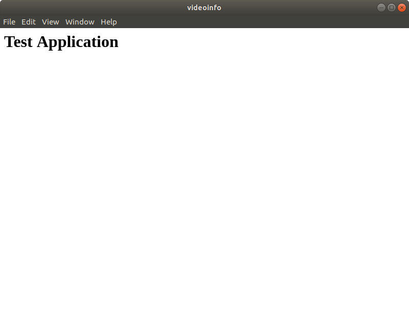
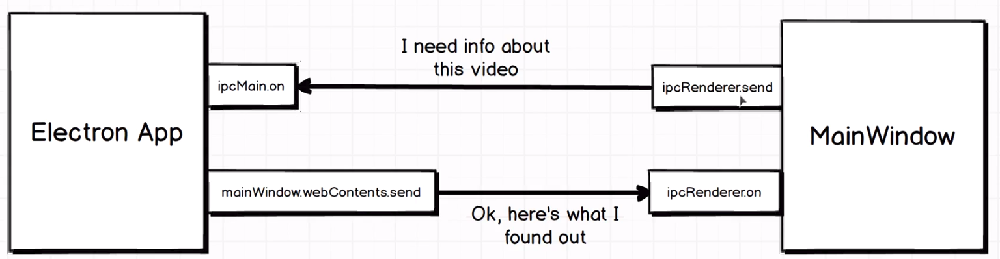
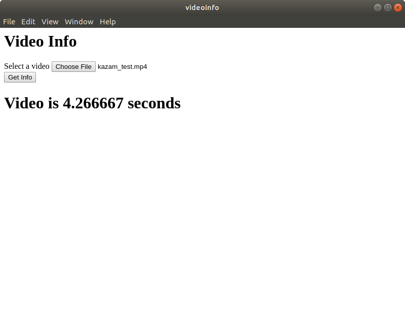

# Electron Notes
Notes for using electron, a desktop application platform which developers can program GUI's using HTML, CSS, and JS.


## Prerequisites
1. Install npm

<hr>

## Starting a new electron project

### - Initializing the package.json file
To initialize the electron project, the package.json file must be created and electron must be associated to it. To do so run the following in the project directory.
```bash
npm init
```
A prompt will appear which will allow you to modify the information in the json file. These can all be left as default. Next add electron to the project with:
```bash
npm install --save electron
```
Then the package.json file must be edited so that electron is run instead of just node.js. Simply edit the package.json file so that the scripts tag reads as such
```json
"scripts": {
  "electron": "electron ."
},
```
### - Creating the js and html files
By default, the package.json file will look for a file called index.js when running the electron application. This can be changed in the package.json file if desired. The base code for index.js to utilize electron is the following:
```javascript

const electron = require('electron');

const { app, BrowserWindow } = electron;

app.on('ready', () => {
  // console.log("App is now ready");
  const mainWindow = new BrowserWindow({});
  mainWindow.loadURL(`file://${__dirname}/index.html`)
});
```
This file points to a html file called index.html, which is in the same directory as index.js. Some base code for the index.html document is as follows:
```HTML
<head>
</head>
<body>
  <h1> Test Application </h1>  
</body>
```

### - Running the Application
To run the desktop application, use the following command in the project directory
```bash
npm run electron
```
A window should then appear that looks similar to this:

<hr>

##  Communicating between electron and the browser window

Electron communicates with the application window through Inter-Process Communication (ipc).

##### Front End Application GUI (HTML Document)
If you wanted to send data from the application GUI to electron (index.html --> index.js) it can be done by adding the following
```HTML
<script type="text/javascript">
  const electron = require('electron');
  const { ipcRenderer } = electron;
  ipcRenderer.send('name_of_info', 'info being sent');
</script>
```
Where ipcRenderer is the ipc object in the electron library. This allows communication through the browser window to the back end electron code in the index.js file.
<br><br>
To receive information from electron to the application GUI (index.js --> index.html) it can be done by adding the following
```HTML
<script>
  ipcRenderer.on('name_of_info', (event, received_info) => {   //received_info is just a variable name and can be changed
    //Add code here to use data given, in this case received_info
  });
</script>

```
##### Back End Electron (JavaScript File)
To use the information sent by the application GUI in electron (index.html --> index.js), use the ipcRenderer object. To do this the following can be added to the index.js file:
```javascript
ipcMain.on('name_of_info', (event, received_info) => {    //received_info is just a variable name and can be changed
  //Add code here to use data given, in this case received_info
});

```
To send data from electron to the application GUI (index.js --> index.html) use the following
```javascript
mainWindow.webContents.send('name_of_info', 'info being sent');
```

<hr>

## Video Info Application
The files in this repository reflect the use of electron and the communication methods explained above to create a GUI application that returns the duration of a video file using the fluent-ffmpeg npm package.


<hr>

## Stopping the script
To stop the application just use 'Ctrl + C' in the terminal running the application, or clicking the 'X' button on the application GUI, or going to File -> Quit on the application GUI.
